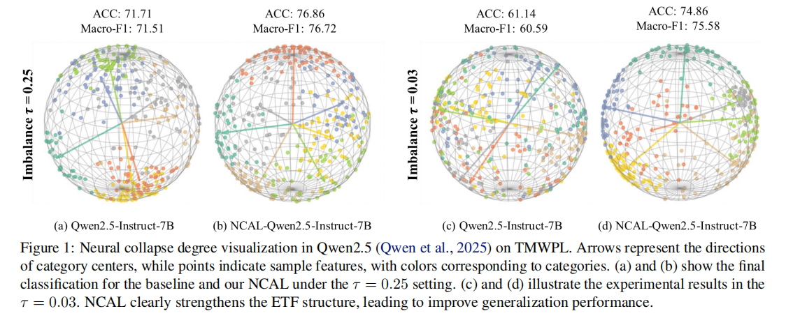
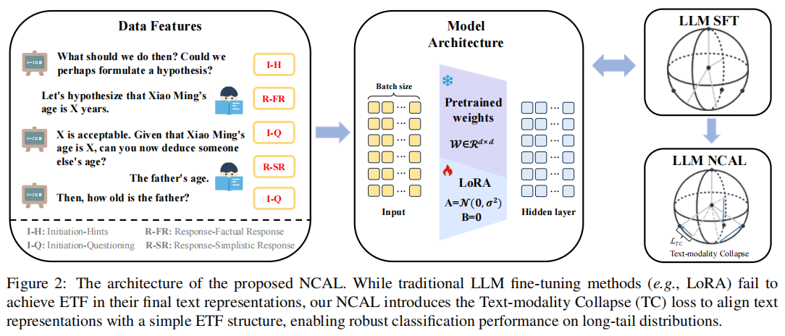
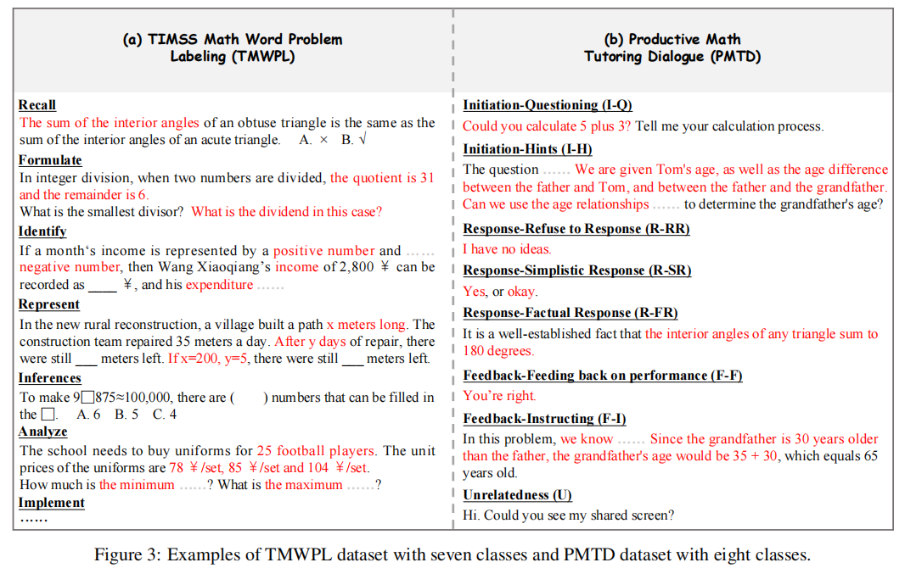
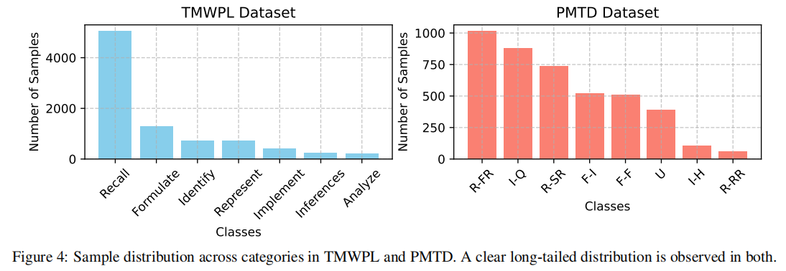
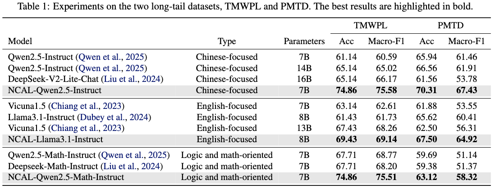

# NCAL-ICML2025
[](LICENSE)
[](https://www.python.org/downloads/)
[](https://pytorch.org/)

>**This is the official implementation of ICML 2025 paper "[Advancing Personalized Learning with Neural Collapse for Long-Tail Challenge](https://icml.cc/virtual/2025/poster/45037)".**

## Paper Overview

**Abstract**: Personalized learning, especially data-based methods, has garnered widespread attention in recent years, aiming to meet individual student needs. However, many works rely on the implicit assumption that benchmarks are high-quality and well-annotated, which limits their practical applicability. In real-world scenarios, these benchmarks often exhibit long-tail distributions, significantly impacting model performance. To address this challenge, we propose a novel method called **N**eural-**C**ollapse-**A**dvanced personalized **L**earning (NCAL), designed to learn features that conform to the same simplex equiangular tight frame (ETF) structure. NCAL introduces text-modality collapse (TC) regularization to optimize the distribution of text embeddings within the large language model (LLM) representation space. Notably, NCAL is model-agnostic, making it compatible with various architectures and approaches, thereby ensuring broad applicability. Extensive experiments demonstrate that NCAL effectively enhances existing works, achieving new state-of-the-art performance. Additionally, NCAL mitigates class imbalance, significantly improving the model's generalization ability.





---

## Dataset Overview

**TMWPL**: The TMWPL dataset is developed based on the TIMSS (Trends in International Mathematics and Science Study) assessment framework, aiming to comprehensively evaluate students' mathematical cognitive abilities. It covers seven core cognitive dimensions defined in the TIMSS Mathematics Cognitive Domains: Recall, Formulate, Identify, Represent, Implement, Inferences, and Analyze. The dataset consists of math word problems designed for students in grades 3 to 6, systematically annotated by professional education experts. Each problem was independently labeled by three to five annotators, with the final label determined by majority voting. Among the dimensions, Recall has the highest number of samples (5,045), while Analyze has the fewest (216). The test set includes 50 samples per cognitive dimension, with the remaining data used for training.

**PMTD**: The PMTD dataset captures one-on-one instructional interactions between teachers and students, with a particular focus on guided teaching strategies used to support students in solving challenging math problems. Drawing on the IRF framework and scaffolding theory, we collaborated with experts from the Education University to design an analytical framework comprising three primary categories and eight subcategories: Teacher Initiation (I-Q, I-H), Student Response (R-RR, R-SR, R-FR), Teacher Feedback (F-I, F-F), and Unrelated Content (U). Two trained annotators conducted the labeling process, achieving an inter-rater reliability of 86% (Cohen's Kappa), with any disagreements resolved through discussion. Among all categories, R-FR (feedback-related student responses) is the most frequent, accounting for 1,014 samples, while R-RR (repetition responses) is the least frequent, with only 62 samples. The test set includes 40 samples for each category, and the remaining data is used for training.





---

## Project Structure

```
NCAL-ICML2025/
├── README.md                # This file
├── requirements.txt         # Dependencies
├── data/                    # Dataset directory
│   ├── TMWPL_train.jsonl    # TMWPL dataset
│   ├── PMTD_train.jsonl     # PMTD dataset
│   └── train_examplejson    # A training data example
└── code/                    # Source code
    ├── config.py            # Configuration parameters
    ├── dataset.py           # Dataset processing
    ├── model.py             # Model setup utilities
    ├── trainer.py           # NCAL trainer with ETF loss
    ├── train.py             # Main training script
    ├── inference.py         # Inference and evaluation
    ├── train.sh             # Training launch script
    └── inference.sh         # Inference launch script
    
```

---

## Quick Start

### 1. Environment Setup

```bash
# Clone the repository
git clone https://github.com/edu4llm/NCAL-ICML2025.git
cd NCAL-ICML2025

# Create conda environment
conda create -n ncal python=3.10 -y
conda activate ncal

# Install dependencies
cd code
pip install -r requirements.txt
```

### 2. Data Preparation

The datasets are provided in the `data/` directory.

Data format example:
```json
{
    "conversation": [
        {
            "role": "user",
            "content": "小明家今年一月份电话费83.5元，以后每个月都比上个月节约6.8元．那么他家今年四月份应付电话费多少元？"
        }
    ],
    "label": "选取策略"
}
```

### 3. Training

#### Option A: Using Bash Script (Recommended)
```bash
cd code

bash train.sh \
    --dataset_path ../data/train_example.json \
    --output_dir ./results_tmwpl \
    --num_train_epochs 5 \
    --lambda_lc 1.0
```

#### Option B: Using Python Script
```bash
cd code

python train.py \
    --dataset_path ../data/train_example.json \
    --model_name_or_path Qwen/Qwen2.5-7B-Instruct \
    --output_dir ./results_tmwpl \
    --use_etf_loss true \
    --lambda_lc 1.0 \
    --num_train_epochs 5
```

### 3 Inference and Evaluation

```bash
cd code

# Interactive testing
bash inference.sh --model_path ./results_tmwpl --interactive

# Single prompt evaluation
bash inference.sh \
    --model_path ./results_tmwpl \
    --prompt "一千零八万是____（A.六 B.七 C.八）位数，写作____．"

# Batch evaluation
bash inference.sh \
    --model_path ./results_tmwpl \
    --prompts_file test_prompts.txt \
    --output_file evaluation_results.json
```

---

## Key Parameters

### NCAL-Specific Parameters
- `--use_etf_loss`: Enable/disable ETF loss (default: true)
- `--lambda_lc`: Weight for ETF loss (default: 0.1)
- `--e_w`: Norm constraint for feature vectors (default: 1.0)
- `--class_diff`: Compute ETF loss only for different classes (default: true)

### LoRA Parameters
- `--use_lora`: Enable/disable LoRA fine-tuning (default: true)
- `--lora_r`: LoRA rank (default: 8)
- `--lora_alpha`: LoRA alpha parameter (default: 32)
- `--lora_dropout`: LoRA dropout rate (default: 0.1)

### Training Parameters
- `--num_train_epochs`: Number of training epochs
- `--per_device_train_batch_size`: Batch size per device
- `--learning_rate`: Learning rate (default: 2e-4)
- `--cutoff_len`: Maximum sequence length (default: 2048)
---

## Codebase Overview

Our implementation features:

- **Modular Design**: Clean separation of concerns with dedicated modules for data, model, and training
- **Flexible Configuration**: Support for command-line arguments, JSON configs, and environment variables  
- **NCAL Integration**: Custom trainer implementing ETF loss for neural collapse
- **LoRA Support**: Efficient fine-tuning with parameter-efficient methods
- **Comprehensive Logging**: Detailed training metrics and GPU memory monitoring
- **Easy Evaluation**: Built-in inference tools for model testing

### Core Components

1. **ETF Loss Implementation** (`trainer.py`): Neural collapse regularization for long-tail learning
2. **LoRA Integration** (`model.py`): Parameter-efficient fine-tuning support
3. **Dataset Processing** (`dataset.py`): Conversation format handling with class labels
4. **Flexible Training** (`train.py`): Main training pipeline with extensive configuration options

---

## Experimental Results



## Citation

Please cite our paper if you find this work useful:

```bibtex
@inproceedings{hu2025ncal,
  title={Advancing Personalized Learning with Neural Collapse for Long-Tail Challenge},
  author={Hu, Hanglei and Guo, Yingying and Chen, Zhikang and Cui, Sen and Wu, Fei and Kuang, Kun and Zhang, Min and Jiang, Bo},
  booktitle={Forty-second International Conference on Machine Learning},
  year={2025},
  url={https://openreview.net/forum?id=W7phL2sNif}
}
```
